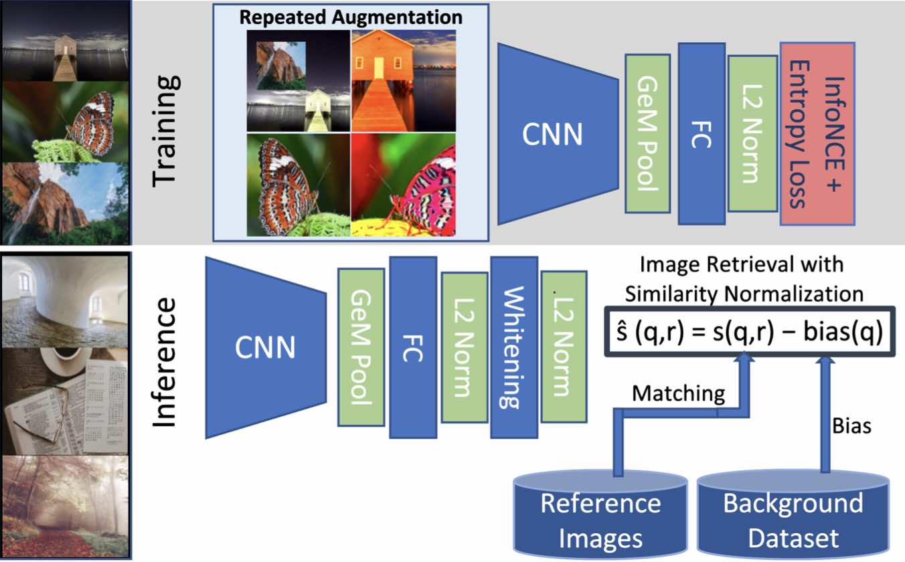

# A Self-Supervised Descriptor for Image Copy Detection (SSCD)

This is the open-source codebase for
"[A Self-Supervised Descriptor for Image Copy Detection](https://arxiv.org/abs/2202.10261)",
recently accepted to [CVPR 2022](https://cvpr2022.thecvf.com/).

This work uses self-supervised contrastive learning with strong
differential entropy regularization to create a fingerprint for
image copy detection.

<div align="center">
  
</div>

## About this codebase

This implementation is built on [Pytorch Lightning](https://pytorchlightning.ai/),
with some components from [Classy Vision](https://classyvision.ai/).

Our original experiments were conducted in a proprietary codebase
using data files (fonts and emoji) that are not licensed for
redistribution.
This version uses [Noto](https://fonts.google.com/noto) fonts and
[Twemoji](https://twemoji.twitter.com/) emoji, via the
[AugLy](https://github.com/facebookresearch/AugLy) project.
As a result, models trained in this codebase perform slightly differently
than our pretrained models.

## Pretrained models

We provide trained models from our original experiments to allow
others to reproduce our evaluation results.

For convenience, we provide equivalent model files in a few formats:
 * Files ending in `.classy.pt` are weight files using Classy Vision ResNe(X)t backbones,
   which is how these models were trained.
 * Files ending in `.torchvision.pt` are weight files using Torchvision ResNet backbones.
   These files may be easier to integrate in Torchvision-based codebases.
   See [model.py](sscd/models/model.py) for how we integrate GeM pooling
   and L2 normalization into these models.
 * Files ending in `.torchscript.pt` are standalone [TorchScript](https://pytorch.org/docs/stable/jit.html)
   models that can be used in any pytorch project without any SSCD code.

We provide the following models:

| name                   | dataset  | trunk           | augmentations    | dimensions | classy vision                                                                               | torchvision                                                                                      | torchscript                                                                                      |
|------------------------|----------|-----------------|------------------|------------|---------------------------------------------------------------------------------------------|--------------------------------------------------------------------------------------------------|--------------------------------------------------------------------------------------------------|
| sscd_disc_blur         | DISC     | ResNet50        | strong blur      | 512        | [link](https://dl.fbaipublicfiles.com/sscd-copy-detection/sscd_disc_blur.classy.pt)         | [link](https://dl.fbaipublicfiles.com/sscd-copy-detection/sscd_disc_blur.torchvision.pt)         | [link](https://dl.fbaipublicfiles.com/sscd-copy-detection/sscd_disc_blur.torchscript.pt)         |
| sscd_disc_advanced     | DISC     | ResNet50        | advanced         | 512        | [link](https://dl.fbaipublicfiles.com/sscd-copy-detection/sscd_disc_advanced.classy.pt)     | [link](https://dl.fbaipublicfiles.com/sscd-copy-detection/sscd_disc_advanced.torchvision.pt)     | [link](https://dl.fbaipublicfiles.com/sscd-copy-detection/sscd_disc_advanced.torchscript.pt)     |
| sscd_disc_mixup        | DISC     | ResNet50        | advanced + mixup | 512        | [link](https://dl.fbaipublicfiles.com/sscd-copy-detection/sscd_disc_mixup.classy.pt)        | [link](https://dl.fbaipublicfiles.com/sscd-copy-detection/sscd_disc_mixup.torchvision.pt)        | [link](https://dl.fbaipublicfiles.com/sscd-copy-detection/sscd_disc_mixup.torchscript.pt)        |
| sscd_disc_large        | DISC     | ResNeXt101 32x4 | advanced + mixup | 1024       | [link](https://dl.fbaipublicfiles.com/sscd-copy-detection/sscd_disc_large.classy.pt)        |                                                                                                  | [link](https://dl.fbaipublicfiles.com/sscd-copy-detection/sscd_disc_large.torchscript.pt)        |
| sscd_imagenet_blur     | ImageNet | ResNet50        | strong blur      | 512        | [link](https://dl.fbaipublicfiles.com/sscd-copy-detection/sscd_imagenet_blur.classy.pt)     | [link](https://dl.fbaipublicfiles.com/sscd-copy-detection/sscd_imagenet_blur.torchvision.pt)     | [link](https://dl.fbaipublicfiles.com/sscd-copy-detection/sscd_imagenet_blur.torchscript.pt)     |
| sscd_imagenet_advanced | ImageNet | ResNet50        | advanced         | 512        | [link](https://dl.fbaipublicfiles.com/sscd-copy-detection/sscd_imagenet_advanced.classy.pt) | [link](https://dl.fbaipublicfiles.com/sscd-copy-detection/sscd_imagenet_advanced.torchvision.pt) | [link](https://dl.fbaipublicfiles.com/sscd-copy-detection/sscd_imagenet_advanced.torchscript.pt) |
| sscd_imagenet_mixup    | ImageNet | ResNet50        | advanced + mixup | 512        | [link](https://dl.fbaipublicfiles.com/sscd-copy-detection/sscd_imagenet_mixup.classy.pt)    | [link](https://dl.fbaipublicfiles.com/sscd-copy-detection/sscd_imagenet_mixup.torchvision.pt)    | [link](https://dl.fbaipublicfiles.com/sscd-copy-detection/sscd_imagenet_mixup.torchscript.pt)    |

We recommend `sscd_disc_mixup` (ResNet50) as a default SSCD model,
especially when comparing to other standard ResNet50 models,
and `sscd_disc_large` (ResNeXt101) as a higher accuracy alternative
using a bit more compute.

Classy Vision and Torchvision use different default cardinality settings
for ResNeXt101. We do not provide a Torchvision version of the
`sscd_disc_large` model for this reason.

## Installation

If you only plan to use torchscript models for inference,
**no installation steps are necessary**, and any environment with
a recent version of pytorch installed can run our torchscript
models.

For all other uses, see installation steps below.

The code is written for pytorch-lightning 1.5 (the latest version
at time of writing), and may need changes for future Lightning
versions.

### Option 1: Install dependencies using Conda

Install and activate conda, then create a conda environment for SSCD as follows:

```bash
# Create conda environment
conda create --name sscd -c pytorch -c conda-forge \
  pytorch torchvision cudatoolkit=11.3 \
  "pytorch-lightning>=1.5,<1.6" lightning-bolts \
  faiss python-magic pandas numpy

# Activate environment
conda activate sscd

# Install Classy Vision and AugLy from PIP:
python -m pip install classy_vision augly
```

You may need to select a `cudatoolkit` version that corresponds
to the system CUDA library version you have installed.
See [PyTorch documentation](https://pytorch.org/) for supported
combinations of pytorch, torchvision and cudatoolkit versions.

For a non-CUDA (CPU only) installation, replace `cudatoolkit=...` with `cpuonly`.

### Option 2: Install dependencies using PIP

```bash
# Create environment
python3 -m virtualenv ./venv

# Activate environment
source ./venv/bin/activate

# Install dependencies in this environment
python -m pip install -r ./requirements.txt --extra-index-url https://download.pytorch.org/whl/cu113
```
The `--extra-index-url` option selects a newer version of CUDA
libraries, required for NVidia A100 GPUs. This can be omitted
if A100 support is not needed.

## Inference using SSCD models

This section describes how to use pretrained SSCD models for inference.
To perform inference for DISC and Copydays evaluations, see
[Evaluation](docs/Evaluation.md).

### Preprocessing

We recommend preprocessing images for inference either resizing
the small edge to 288 or resizing the image to a square tensor.

Using fixed-sized square tensors is more efficient on GPUs, to make
better use of batching.
Copy detection using square tensors benefits from directly resizing
to the target tensor size. This skews the image, and does not preserve
aspect ratio. This differs from the common practice for
classification inference.

```python
from torchvision import transforms

normalize = transforms.Normalize(
    mean=[0.485, 0.456, 0.406], std=[0.229, 0.224, 0.225],
)
small_288 = transforms.Compose([
    transforms.Resize(288),
    transforms.ToTensor(),
    normalize,
])
skew_320 = transforms.Compose([
    transforms.Resize([320, 320]),
    transforms.ToTensor(),
    normalize,
])
```

### Inference using Torchscript

Torchscript files can be loaded directly in other projects without any SSCD code or dependencies.

```python
import torch
from PIL import Image

model = torch.jit.load("/path/to/sscd_disc_mixup.torchscript.pt")
img = Image.open("/path/to/image.png").convert('RGB')
batch = small_288(img).unsqueeze(0)
embedding = model(batch)[0, :]
```

These Torchscript models are prepared for inference. For other uses (eg. fine-tuning),
use model weight files, as described below.

### Load model weight files

To load model weight files, first construct the `Model` object,
then load the weights using the standard `torch.load` and `load_state_dict`
methods.

```python
import torch
from sscd.models.model import Model

model = Model("CV_RESNET50", 512, 3.0)
weights = torch.load("/path/to/sscd_disc_mixup.classy.pt")
model.load_state_dict(weights)
model.eval()
```

Once loaded, these models can be used interchangeably with Torchscript
models for inference.

Model backbone strings can be found in the `Backbone`
enum in [model.py](sscd/models/model.py). Classy Vision models start
with the prefix `CV_` and Torchvision models start with `TV_`.

### Using SSCD descriptors

SSCD models produce 512 dimension (except the "large" model, which uses 1024 dimensions)
L2 normalized descriptors for each input image.
The similarity of two images with descriptors `a` and `b` can be measured
by descriptor cosine similarity (`a.dot(b)`; higher is more similar),
or equivalently using euclidean distance (`(a-b).norm()`; lower is more similar).

For the `sscd_disc_mixup` model, DISC image pairs with embedding cosine similarity greater
than `0.75` are copies with 90% precision, for example. This corresponds to a euclidean
distance less than `0.7`, or squared euclidean distance less than `0.5`.

#### Descriptor post-processing

For best results, we recommend additional descriptor processing
when sample images from the target distribution are available.
Centering (subtracting the mean) followed by L2 normalization,
or whitening followed by L2 normalization, can improve accuracy.

Score normalization can make similarity more consistent and
improve global accuracy metrics (but has no effect on ranking metrics).

### Other model formats

If pretrained models in another format (eg. ONYX) would be useful for you,
let us know by filing a feature request.

## Reproducing evaluation results

To reproduce evaluation results, see [Evaluation](docs/Evaluation.md).

## Training SSCD models

For information on how to train SSCD models, see 
[Training](docs/Training.md).

## License

The SSCD codebase uses the [MIT license](LICENSE).

## Citation

If you find our codebase useful, please consider giving a star :star: and cite as:

```
@article{pizzi2022self,
  title={A Self-Supervised Descriptor for Image Copy Detection},
  author={Pizzi, Ed and Roy, Sreya Dutta and Ravindra, Sugosh Nagavara and Goyal, Priya and Douze, Matthijs},
  journal={Proc. CVPR},
  year={2022}
}
```
